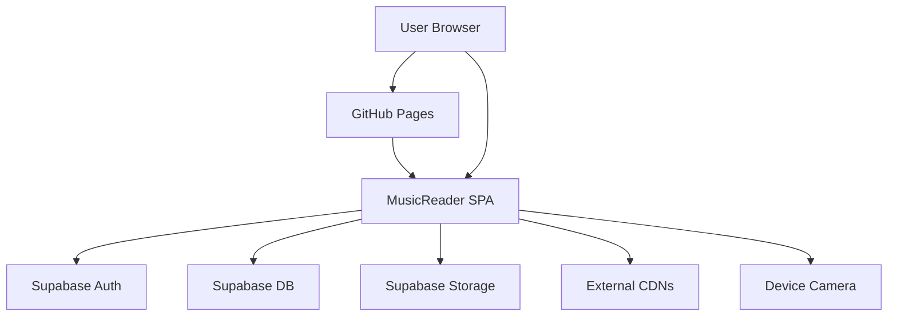

## Executive summary
MusicReader is a client-only SPA hosted on GitHub Pages that relies on Supabase Auth/DB/Storage for all persistence. The highest-risk themes are multi-tenant data isolation (RLS and storage policies are the only access control), client-side injection paths that could expose Supabase sessions or signed URLs, and public sign-up abuse (storage/cost and availability). The most security-critical areas are Supabase policy configuration, client-side rendering of user-controlled metadata in the viewer, and the file upload and parsing pipeline (PDF/MusicXML/MXL).

## Scope and assumptions
In-scope paths: `src/`, `public/sw.js`, `index.html`, `SUPABASE_SETUP.md`, `.github/workflows/deploy.yml`, `vite.config.js`, `package.json`.
Out-of-scope: `dist/`, `node_modules/`, any external Supabase project configuration not captured in `SUPABASE_SETUP.md`.
Assumptions: Public sign-ups are allowed but intended for a small private group; no sharing features; data sensitivity is low (public sheet music and user emails); Supabase is the only backend; RLS and storage policies are applied per `SUPABASE_SETUP.md`.
Open questions that could change risk ranking: Are email confirmations enforced for new accounts; are any Supabase rate limits, CAPTCHA, or abuse protections enabled; are storage quotas or file size limits enforced at the project level.

## System model
### Primary components
- MusicReader SPA (Vite + vanilla JS) served as static assets, entry in `index.html` and `src/main.js`.
- Client routing and auth gating via hash router in `src/router.js` and Supabase auth in `src/auth.js`.
- Supabase client and storage access in `src/supabaseClient.js`.
- Supabase database tables and RLS policies in `SUPABASE_SETUP.md`.
- File rendering pipelines: PDF.js in `src/pdfViewer.js`, OpenSheetMusicDisplay and JSZip in `src/xmlViewer.js`.
- Camera-based gesture control via MediaPipe in `src/faceControl.js`.
- Service worker for offline caching in `public/sw.js`.
- GitHub Actions build and deploy in `.github/workflows/deploy.yml`.

### Data flows and trust boundaries
- User browser input → MusicReader SPA. Data: credentials, file metadata, files; Channel: DOM/JS; Security: browser sandbox, same-origin; Validation: client-side extension checks in `src/utils.js` and form constraints in `src/auth.js` and `src/uploader.js`.
- MusicReader SPA → Supabase Auth/DB/Storage. Data: auth credentials, session tokens, score metadata, preferences, setlists, file objects; Channel: HTTPS via `@supabase/supabase-js`; Security: Supabase auth session and RLS policies in `SUPABASE_SETUP.md`; Validation: RLS/storage policies, minimal client-side checks.
- MusicReader SPA → Supabase Storage signed URLs. Data: time-limited URLs and file content; Channel: HTTPS; Security: signed URL expiry (default 300s) in `src/supabaseClient.js`; Validation: none beyond URL expiry.
- MusicReader SPA → External CDNs. Data: fetch of PDF.js cmaps and MediaPipe wasm/model; Channel: HTTPS; Security: TLS only, no integrity pinning in `src/pdfViewer.js` and `src/faceControl.js`.
- MusicReader SPA ↔ Device camera. Data: camera video frames; Channel: local device APIs; Security: user permission prompts and local-only processing in `src/faceControl.js`.
- GitHub Actions → GitHub Pages. Data: build artifacts and embedded env values; Channel: GitHub Actions; Security: GitHub Actions permissions and secrets in `.github/workflows/deploy.yml` and `vite.config.js`.

#### Diagram

## Assets and security objectives
| Asset | Why it matters | Security objective (C/I/A) |
| --- | --- | --- |
| Supabase auth session tokens | Authorize DB and storage access for a user | C/I |
| Uploaded sheet music files | User content and potential copyrighted material | C/I/A |
| Score metadata and setlists | Organizes user content and playback state | C/I |
| Viewer preferences and last positions | User experience and privacy | C/I |
| App integrity (SPA assets + service worker) | Controls what code runs in the browser | I/A |
| Supabase storage and DB resources | Cost and availability for the service | A |

## Attacker model
### Capabilities
- Remote internet user can sign up and authenticate (public sign-ups).
- Can upload files and metadata through the client UI.
- Can manipulate hash routes and identifiers (`scoreId`, `setlistId`) in the URL.
- Can call Supabase APIs directly using the public anon key in the SPA bundle.
- Can attempt to abuse storage and database quotas by uploading large or many files.

### Non-capabilities
- No server-side code execution in this repo; attacker cannot run code on a MusicReader backend.
- Cannot access other users’ data if Supabase RLS and storage policies are correct.
- Cannot access or exfiltrate camera frames unless code is compromised or permissions are granted.
- Cannot modify GitHub Pages deployment without repository or CI compromise.

## Entry points and attack surfaces
| Surface | How reached | Trust boundary | Notes | Evidence (repo path / symbol) |
| --- | --- | --- | --- | --- |
| Login and signup forms | `#/login`, `#/signup` routes | User input → SPA → Supabase Auth | Credentials sent to Supabase auth | `src/auth.js`, `src/router.js` |
| Hash routes with IDs | `#/viewer/:scoreId` and setlist route | URL input → SPA → Supabase DB | ID parameters used to fetch data | `src/router.js`, `src/viewer.js` |
| File upload | Upload modal | User file → SPA → Supabase Storage | Only extension validation | `src/uploader.js`, `src/utils.js` |
| Signed URL access | Viewer loads score | SPA → Storage via signed URL | Time-limited access, URL cached in memory | `src/supabaseClient.js`, `src/pdfViewer.js`, `src/xmlViewer.js` |
| PDF and MusicXML parsing | Viewer render | Untrusted file → client parser | pdfjs + OSMD + JSZip parsing | `src/pdfViewer.js`, `src/xmlViewer.js` |
| Service worker | App init | Browser → SW cache | Offline caching of app shell | `public/sw.js`, `src/main.js` |
| Camera access | Camera toggle | SPA → Device API | getUserMedia permission and local processing | `src/faceControl.js`, `src/viewer.js` |

## Top abuse paths
1. Attacker signs up, enumerates or guesses `scoreId`, calls Supabase APIs directly, and accesses another user’s scores if RLS or storage policies are misconfigured.
2. Attacker uploads a crafted PDF/MXL that causes client-side resource exhaustion, degrading performance or crashing the viewer during rendering.
3. Attacker abuses public sign-up and uploads many large files, exhausting storage quotas or driving costs and impacting availability.
4. Attacker injects HTML into score title/composer, triggers stored XSS in the viewer header, and exfiltrates Supabase session tokens.
5. Attacker obtains a signed URL via XSS or local compromise and uses it to download private sheet music within the expiry window.
6. Attacker exploits a compromised CDN asset (MediaPipe wasm/model or PDF.js cmaps) to run malicious code in clients.
7. Attacker achieves XSS and registers a malicious service worker, persisting control on the origin for future sessions.

## Threat model table
| Threat ID | Threat source | Prerequisites | Threat action | Impact | Impacted assets | Existing controls (evidence) | Gaps | Recommended mitigations | Detection ideas | Likelihood | Impact severity | Priority |
| --- | --- | --- | --- | --- | --- | --- | --- | --- | --- | --- | --- | --- |
| TM-001 | Authenticated attacker | Valid account; RLS or storage policies missing or incorrect | Query/guess IDs and read or modify other users’ scores, setlists, or files | Cross-tenant data disclosure or tampering | Files, scores, setlists, prefs | RLS and storage policies in `SUPABASE_SETUP.md`; client only uses anon key in `src/supabaseClient.js` | No server-side access control beyond RLS; no automated RLS tests or audit checks | Add automated RLS tests, periodic policy audits, and storage policy tests; restrict data fields returned; consider row-level ownership assertions in queries | Supabase logs for abnormal access patterns; monitor auth.uid mismatches and high error rates | Medium | High | High |
| TM-002 | Authenticated attacker, XSS | Ability to inject HTML into score metadata | Stored XSS in viewer header, token theft or malicious actions | Session compromise, data exfiltration | Session tokens, user data | Some HTML escaping in `src/library.js` and `src/setlists.js` | Viewer header uses raw `currentScore.title` and `composer` in `src/viewer.js` | Escape or sanitize all user-controlled fields before `innerHTML`; prefer text nodes; add CSP to reduce XSS impact | Client error logging, CSP violation reporting endpoint | Medium | High | High |
| TM-003 | Authenticated attacker | Public sign-up, no quotas | Upload large or many files to exhaust storage or cost | Availability and cost impact | Storage resources, service availability | Storage is private and requires auth in `SUPABASE_SETUP.md` | No file size limits or quotas in `src/uploader.js`; no abuse controls noted | Enforce storage quotas and max file sizes; add rate limits or invite-only access; add CAPTCHA for sign-up | Monitor storage growth, upload rate, and user-level anomalies | Medium | Medium | Medium |
| TM-004 | Authenticated attacker | Upload of crafted PDF/MXL | Exploit parser edge cases to cause client-side DoS or instability | Client availability and UX | Client device availability | Extension-based validation in `src/utils.js` | No file size or content validation; rendering untrusted files with complex libraries | Enforce file size and type checks server-side; add pre-processing or validation; sandbox rendering in workers where possible | Client-side error telemetry; monitor crash rates | Medium | Medium | Medium |
| TM-005 | XSS or local compromise | Signed URL exposure | Use leaked signed URL to download private files | Temporary file disclosure | Sheet music files | Signed URL expiry (default 300s) in `src/supabaseClient.js` | Signed URLs exist in memory; no referrer or token binding | Reduce URL lifetime further; set `referrerPolicy` on fetch; rotate URLs on view; avoid logging URLs | Monitor storage download patterns; alert on unusual downloads | Low | Medium | Medium |
| TM-006 | Supply chain attacker | Compromised CDN or dependency | Serve malicious wasm/model/cmap to clients | Code execution in clients | App integrity, user data | HTTPS delivery; dependencies pinned in `package.json` | No SRI or self-hosting for CDN assets in `src/pdfViewer.js` and `src/faceControl.js` | Self-host MediaPipe and PDF.js assets; use integrity hashes; pin versions explicitly | Dependency monitoring; alert on asset hash changes | Low | High | Medium |
| TM-007 | XSS attacker | Achieve script execution on origin | Register malicious service worker and persist control | Persistent compromise | App integrity, user data | SW restricted to same origin in `public/sw.js` | No CSP or integrity protections to block XSS | Add CSP, avoid `innerHTML`, and consider SW update hardening; allow SW unregister on auth logout | Monitor SW updates, client telemetry for SW version drift | Low | High | Medium |

## Criticality calibration
Critical means direct cross-tenant data compromise or persistent compromise of the app at scale. Examples: RLS failure allowing access to other users’ files; service worker persistence across users.
High means loss of confidentiality or integrity for a single user or easy escalation with moderate prerequisites. Examples: stored XSS that exposes session tokens; compromise of CDN assets used on all clients.
Medium means limited scope or requires stronger prerequisites. Examples: large-file upload abuse causing cost impact; client-side DoS via malicious PDFs or MXL files.
Low means issues with minimal impact or highly unlikely conditions. Examples: short-lived signed URL leakage without XSS; minor information leaks from UI errors.

## Focus paths for security review
| Path | Why it matters | Related Threat IDs |
| --- | --- | --- |
| `src/supabaseClient.js` | Auth/session handling and signed URL creation | TM-001, TM-005 |
| `SUPABASE_SETUP.md` | RLS and storage policies are the primary access control | TM-001 |
| `src/viewer.js` | Unescaped user-controlled metadata in viewer header | TM-002, TM-007 |
| `src/library.js` | Score listing and metadata rendering | TM-001, TM-002 |
| `src/uploader.js` | File upload path and metadata insertion | TM-003, TM-004 |
| `src/pdfViewer.js` | PDF rendering and external CDN dependency | TM-004, TM-006 |
| `src/xmlViewer.js` | MusicXML/MXL parsing with JSZip | TM-004 |
| `src/faceControl.js` | Camera access and MediaPipe CDN assets | TM-006 |
| `public/sw.js` | Service worker caching and persistence | TM-007 |
| `.github/workflows/deploy.yml` | Build pipeline and secret injection | TM-006 |
| `index.html` | App shell and script loading | TM-006, TM-007 |

Quality check: Covered entry points; each trust boundary appears in threats; runtime vs CI/dev separation included; user context reflected; assumptions and open questions explicit.
